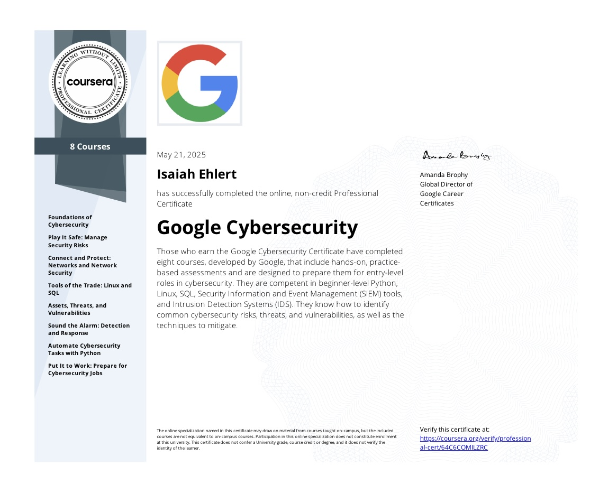
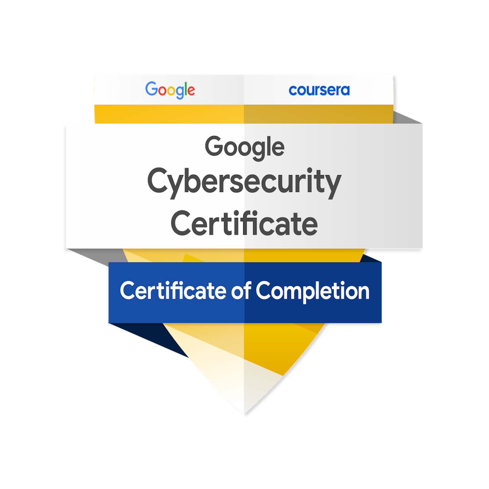
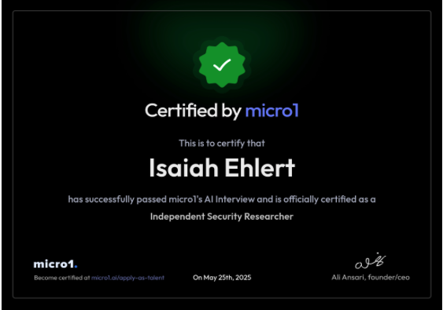
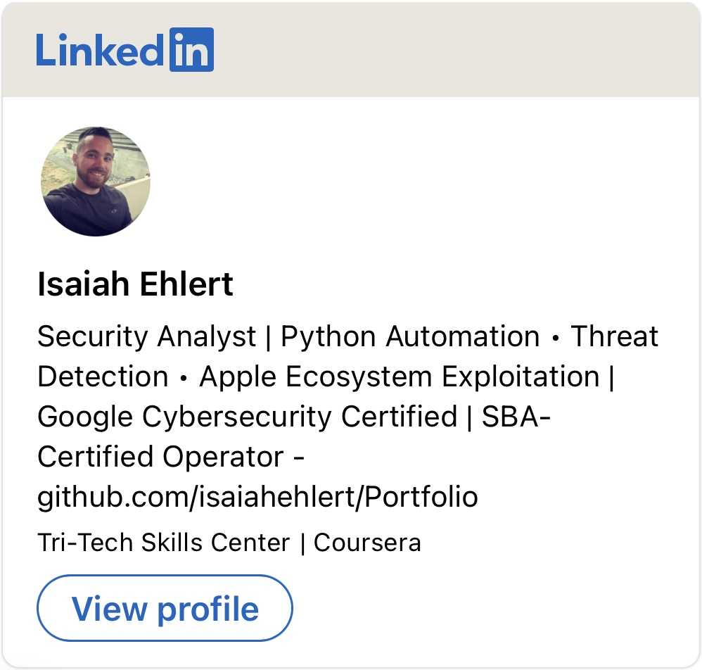

# 🧭 Cybersecurity Portfolio — Isaiah Ryan Ehlert

> A curated showcase of hands-on labs, credentials, and real-world technical work built while completing:
> 
> - 🛡️ The [Google Cybersecurity Certificate](https://www.coursera.org/professional-certificates/google-cybersecurity)  
> - 🖥️ The [Google IT Support Professional Certificate](https://www.coursera.org/professional-certificates/google-it-support)

Both certificate tracks contribute toward my upcoming B.S. in Cybersecurity & Information Assurance at WGU (Western Governors University, Class of 2027).

---

## 👨‍💻 Professional Statement

I am an adaptable and mission-driven cybersecurity and IT professional with a background in high-risk, high-accountability environments. I value integrity, continuous learning, and ethical responsibility in securing digital systems and supporting technical infrastructure.

Key areas of focus:

- **Python for security automation**
- **Digital forensics & threat analysis**
- **IT support & troubleshooting**
- **Incident response & system hardening**
- **Risk management & infrastructure visibility**

My mission: **solve real problems, reduce digital risk, and empower secure, stable operations**.

---

## 🗂️ Portfolio Structure

This repository is organized into learning tracks:

### 🛡️ Google Cybersecurity Certificate  
Courses 01–08 are structured into individual folders. Each contains:

- ✅ Course summary (`README.md`)  
- 🧪 Labs, projects, or case studies  
- 📄 Reflections and documentation  
- 📜 Certificate of completion  

### 🖥️ Google IT Support Certificate   
Each completed course is documented with:

- ✅ Course overview in Markdown  
- 📜 Coursera-issued certificate  
- 📄 Notes or artifacts when applicable  

> _All credential files are stored in the [`credentials/`](./credentials) folder._

---

## 📚 Coursework – Cybersecurity (Classes 01–08)

| Class | Title | Contents |
|-------|-------|----------|
| [Class 02](./Projects/Class-02-Play-It-Safe) | **Play It Safe: Manage Security Risks** | Risk assessments, mitigation plans, internal audit |
| [Class 03](./Projects/Class-03-Connect-and-Protect) | **Connect and Protect: Networks & Network Security** | Packet analysis, TCP/IP, protocols |
| [Class 04](./Projects/Class-04-Tools-of-the-Trade) | **Tools of the Trade: Linux & SQL** | Shell scripting, system logs, SQL queries |
| [Class 05](./Projects/Class-05-Detection-and-Response) | **Detection and Response** | Incident journals, phishing alerts, Wireshark |
| [Class 06](./Projects/Class-06-Sound-The-Alarm) | **Sound the Alarm: Detection and Response Tools** | Playbooks, Suricata, VirusTotal, SOC workflows |
| [Class 07](./Projects/Class-07-Automate-Cybersecurity-Tasks-With-Python) | **Automate Cybersecurity Tasks with Python** | Python automation, file parsing, regex, algorithms |
| [Class 08](./Projects/Class-08-Landing-the-Job) | **Landing the Job** | Security org research, elevator pitch, resume, STAR interview answers |

> _Note: Classes 01 of Cybersecurity and IT Support certs are credential-only — see [`credentials/`](./credentials)._

---

## 🧾 Certifications

| Certification | Link |
|---------------|------|
| **Google Cybersecurity Certificate – Full Program** | [View Cert.](https://www.coursera.org/account/accomplishments/specialization/certificate/64C6COMILZRC) |
| **micro1 Independent Security Researcher** | Certification below |

For all course certificates, see the [`credentials/`](./credentials) folder.

---

## 📌 Active Progress

- ✅ Google Cybersecurity Certificate — **Completed**
- 🔄 Google IT Support Certificate — **Completed** 
- 🎓 WGU Cybersecurity & Information Assurance B.S. — **Currently Enrolled/Attending**

---

## 🔗 Connect with Me

  

